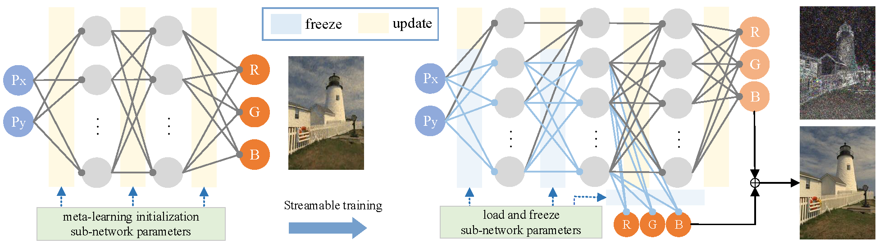

<a name="readme-top"></a>

<!-- PROJECT LOGO -->
<br />
<div align="center">
  <a href="https://github.com/hualuo321/Streamable-INR">
    
  </a>

  <a href="https://github.com/hualuo321/Streamable-INR">
    
  </a>

  <p align="center">
    The streamable implicit neural representations for image compression.
    <br />
    <a href="https://github.com/othneildrew/Best-README-Template"><strong>Explore the docs »</strong></a>
    <br />
    <br />
    <a href="https://github.com/othneildrew/Best-README-Template">View Demo</a>
    ·
    <a href="https://github.com/othneildrew/Best-README-Template/issues">Report Bug</a>
    ·
    <a href="https://github.com/othneildrew/Best-README-Template/issues">Request Feature</a>
  </p>
</div>

<!-- ABOUT THE PROJECT -->
# Streamable-INR
> Our work explores different extension types of streamable implicit neural networks for variable bit-rate image compression. The streamable model consists of sub-networks at varying scales, enabling variable bit-rates compression with a single model and conserving storage space through parameter sharing.



## Environment Configuration

This is an example of how you may give instructions on setting up your project locally.

**Environment :**
* Miniconda 3, Python 3.8 (ubuntu 18.04), Cuda 11.3

* Pytorch 1.9.1+cu111 (注意：必须是 1.9.1 或以下，因为使用官方提供的 torchmeta 模块依赖 1.9.1 前的 Pytorch 版本)

* 更多环境配置信息，请查看 `requirements.txt` 文件

* 最好使用 GPU 训练

**Installation :**
1. 创建 conda 环境：
   ```py
   conda create -n streamable-INR python=3.8
   ```
2. 安装相关依赖：
   ```
   pip install -r requirements.txt -i https://pypi.mirrors.ustc.edu.cn/simple/
   ```
3. 重新安装 Pytorch 模块，覆盖 torchmeta 默认安装的 Pytorch 版本：
   ```
   pip install torch==1.9.1+cu111 torchvision==0.10.1+cu111 -f https://download.pytorch.org/whl/torch_stable.html --no-cache-dir
   ```

**Dataset :**

The `'data/'` directory must be in your working directory.

- Download CelebA dataset from [http://mmlab.ie.cuhk.edu.hk/projects/CelebA.html](http://mmlab.ie.cuhk.edu.hk/projects/CelebA.html).

- Download DIV2K dataset from [https://data.vision.ee.ethz.ch/cvl/DIV2K/](https://data.vision.ee.ethz.ch/cvl/DIV2K/).

- Download Kodak dataset from [https://r0k.us/graphics/kodak/](https://r0k.us/graphics/kodak/).


## File Structure
```
  ├── data: 存储训练时数据集相关信息缓存
  │    ├── CelebA: 200000 张人脸数据集
  │    ├── DIV2K: 1000 张自然图像超分辨率数据集
  │    └── Kodak: 24 张自然图像数据集
  │
  ├── logs: 训练获取的模型，日志，图像相关信息保存
  │     └── train_mode : 训练模式 [COIN, SW, SD, SWD]
  │             ├── eval: 训练日志信息 [PSNR, MS-SSIM, LPIPS]
  │             ├── imgs: 训练图像保存 [train, meta_train]
  │             └── mods: 训练模型保存 [train, meta_train]
  │
  ├── plot: 根据实验结果绘制实相关图像
  │    ├── plot_utils: 绘制图像相关函数
  │    └── plot_imgs: 绘制图像存放路径
  │
  ├── cal_bpp.py: 不同可流化模型在不同模型配置下的 bpp 计算
  ├── dataset.py: 数据读取以及预处理方法，为图片生成 coordinates 和 features
  ├── utils.py: 训练网络过程中使用到的一些方法和工具
  ├── metrics.py: 实现图像评估方法 [PSNR, MS-SSIM, LPIPS]
  ├── main.py: 模型训练相关参数，模块配置
  ├── maml.py: 对模型采用 MAML 元学习训练
  ├── network.py: 实现 COIN 及可流化 INR 模型
  ├── quant_entropy: 实现均匀量化及熵编码
  └── train: 实现不同 INR 模型在不同模式下的训练
```

<!-- GETTING STARTED -->
## Getting Started

To get a local copy up and running follow these simple example steps.

To train a model, run : 

```
python main.py [--mode cur_mode] [--state cur_state] [...]
```

**Configuration Description :**

- **mode :** 训练时所采用的模型，可选择为 [COIN (固定)，WSIC (宽度可流)，DSIC (深度可流)，WDSIC (宽度深度联合可流)] 

- **state :** 训练时所采用的模式，可选择为 [trian (训练)，meta (元学习)，mtrain (元学习初始化训练)，quant_entropy (训练后量化及熵编码)] 

- **widths，depths :** 可流化模型各阶段的宽度，深度配置 

- **lr，out_lr，in_lr :** 训练时学习率，元学习外环学习率，内环学习率

- **data_path，logs_path，meta_path :** 训练数据路径，训练图像保存路径，元学习数据路径

- **epochs，out_epochs，in_epochs :** 训练周期，元学习外环周期，内环周期 
- **lr_type :** 元学习中可变学习率，可选择为 [static (固定)，param (所有参数在内环中分配对应可变学习率)，step_param (所有参数在内环各周期中都分配对应的可变学习率)] 
- **num_bit，std_range，is_entorpy :** 量化位宽，量化阈值，是否熵编码 

## Related Projects
COIN : [https://github.com/EmilienDupont/coin](https://github.com/EmilienDupont/coin)

COIN++ : [https://github.com/EmilienDupont/coinpp](https://github.com/EmilienDupont/coinpp)

MetaSDF : [https://github.com/vsitzmann/metasdf](https://github.com/vsitzmann/metasdf)

Bacon : [https://github.com/computational-imaging/bacon](https://github.com/computational-imaging/bacon)

Streamable-nf : [https://github.com/jwcho5576/streamable_nf](https://github.com/jwcho5576/streamable_nf)

<!-- CONTRIBUTING -->
## Contributing

Contributions are what make the open source community such an amazing place to learn, inspire, and create. Any contributions you make are **greatly appreciated**.

If you have a suggestion that would make this better, please fork the repo and create a pull request. You can also simply open an issue with the tag "enhancement".
Don't forget to give the project a star! Thanks again!

1. Fork the Project
2. Create your Feature Branch (`git checkout -b feature/AmazingFeature`)
3. Commit your Changes (`git commit -m 'Add some AmazingFeature'`)
4. Push to the Branch (`git push origin feature/AmazingFeature`)
5. Open a Pull Request

<!-- LICENSE -->
## License

Distributed under the MIT License. See `LICENSE.txt` for more information.


